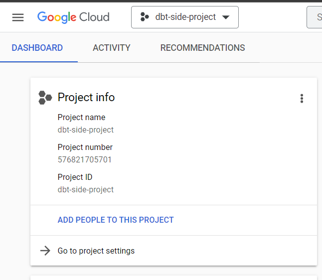
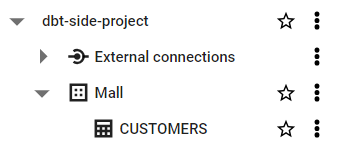
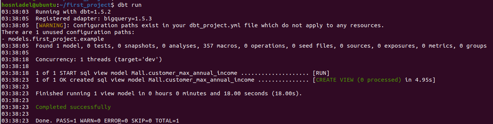
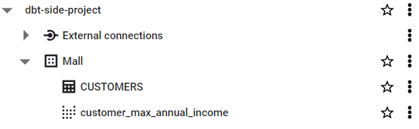
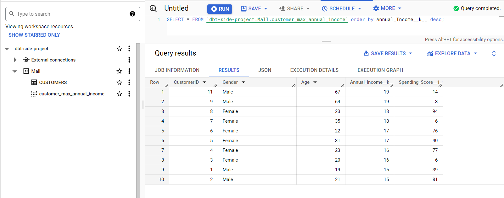

# DBT with BigQuery

## Prerequisites

### Install DBT

Install DBT with BigQuery Adapter

```bash
pip3 install dbt-bigquery
```

### Create project in google cloud



1. Create a dataset and load data into `CUSTOMERS` table



1. Generating Credentials JSON file
    
    In google cloud dashboard go to
    
    > IAM and admin → Service accounts → Manage keys → Add key → Create new key → JSON
    > 

## Start and run the DBT project

### Init Project

```bash
dbt init dbt-big-query
```

### C****onfigure dbt to BigQuery****

In `~/.dbt/profiles.yml` 

```bash
first_project:
  outputs:
    dev:
      dataset: hosni
      job_execution_timeout_seconds: 300
      job_retries: 1
      keyfile: /home/hosniadel/keyfile.json
      location: northamerica-northeast1
      method: service-account
      priority: interactive
      project: eighth-edge-355401
      threads: 1
      type: bigquery
  target: dev
```

### Run Project

```bash
dbt run
```

After running the transformation, you should see that the view or table of your models are created successfully



In BigQuey, you should see the view `customer_max_annual_income` is created successfully 



You can use SQL workspace to apply queries with the created view

